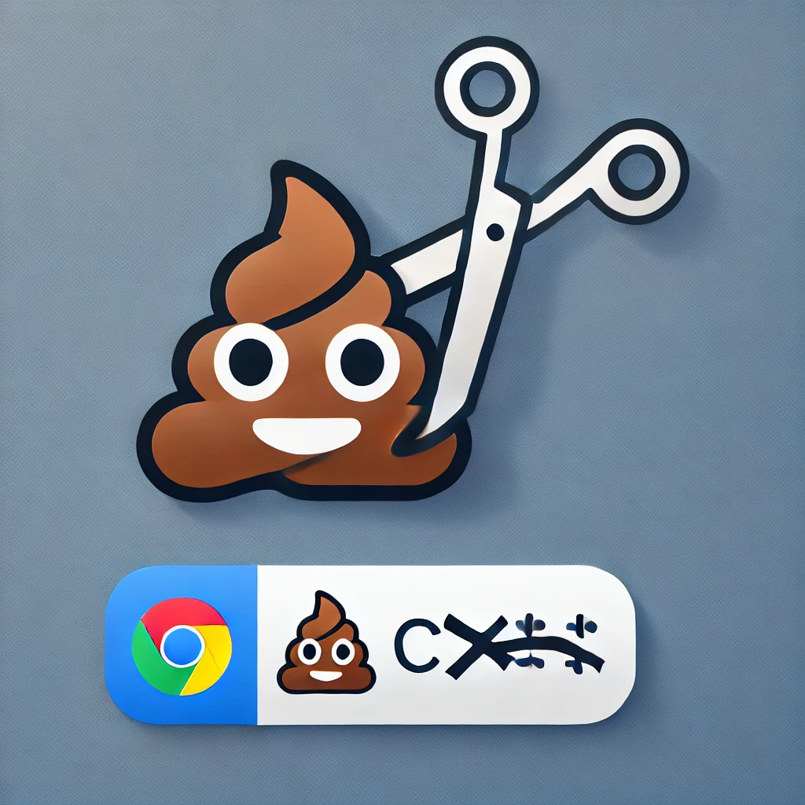
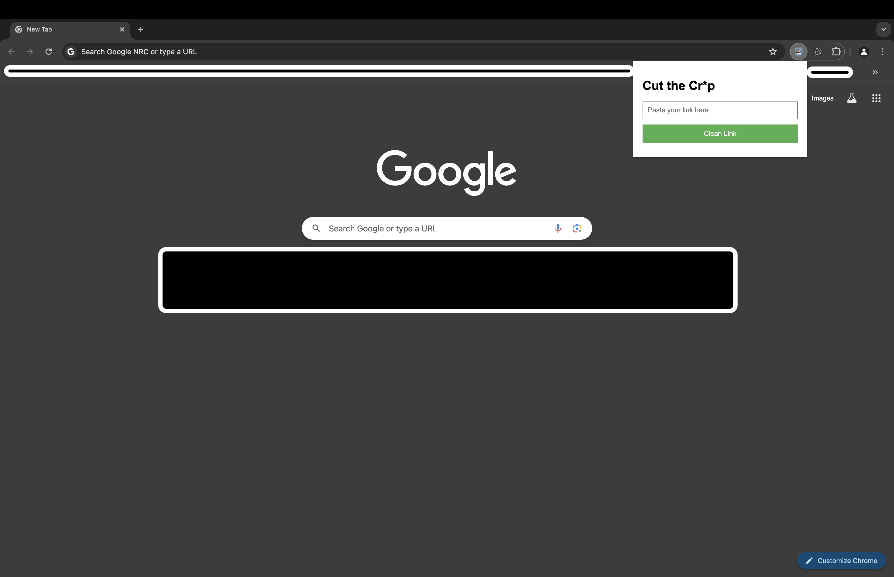

# Cut the Cr*p

A Chrome extension that removes marketing tags and trackers from copied links, ensuring you share clean URLs without unnecessary parameters.

(this logo was generated with ChatGPT, as you can tell)

## Installation:

Load the extension into Chrome:

1. Open Chrome and navigate to `chrome://extensions/`.
2. Enable Developer mode (toggle switch in the top right corner).
3. Click on "Load unpacked" and select the folder containing your extension files.

## Usage

1. **Context Menu**: Right-click on any link and select "Cut the Cr*p" to clean the URL and copy it to the clipboard.
2. **HTML Popup**: Open the popup, paste the link, and click "Clean Link" to get the cleaned URL.
3. **Automatic Cleaning**: *Work in Progress* - This feature aims to automatically clean URLs as you navigate.

## Features

- Removes common tracking parameters such as `utm_source`, `utm_medium`, `utm_campaign`, etc.
- Ensures your shared links are clean and free of unnecessary data.

## Icon

Icons are resized for various uses:
- `icon16.png`: 16x16 pixels
- `icon48.png`: 48x48 pixels
- `icon128.png`: 128x128 pixels

## Screenshots

### HTML Popup Example

## License

This project is licensed under the MIT License.
